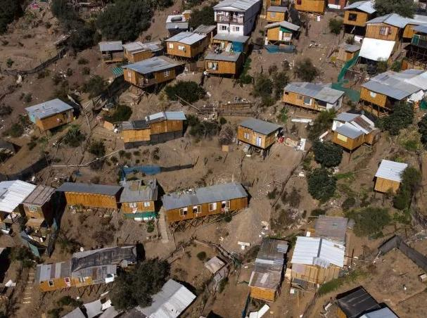

# Deteccion de asentamietos

## Descripción

Los asentamientos son lugares donde familias, que habitan viviendas agrupadas o contiguas, se encuentran en una situación irregular de tenencia del terreno y carecen de acceso regular a uno o más servicios básicos de la vivienda (agua potable, energía eléctrica y alcantarillado/fosa séptica).

Este proyecto, desarrollado en conjunto entre Dymaxion Labs y la [TECHO-Chile](https://chile.techo.org//), tiene por objetivo la detección y seguimiento de los asentamientos, aplicando técnicas basadas en machine learning (ML) para el procesamiento de imágenes satelitales. Esto permite mapear grandes áreas de manera rápida y con bajos recursos.

El modelo está optimizado para las imágenes multiespectrales del satélite Sentinel-2. 

## Requerimientos

Se utilizan las herramientas **GDAL** y [Orfeo Toolbox](https://www.orfeo-toolbox.org/) en la primera etapa del pre-procesamiento de los datos. Luego, se emplean nuestros paquetes [satproc](https://github.com/dymaxionlabs/satproc) y [unetseg](https://github.com/dymaxionlabs/satproc) para la generación del dataset y modelo de ML respectivamente.

## Notebooks

Este repositorio contiene un conjunto de notebooks de Jupyter, que describen los pasos necesarios:

1. [Pre-procesamiento](notebooks/1_Entrenamiento.ipynb): Se procesan las imágenes satelitales, la verdad de campo para generar el dataset de entrenamiento y se entrena y evalua el modelo. 
2. [Entrenamiento](notebooks/2_Prediccion.ipynb):  Predicción sobre la región de interés y procesamiento de los resultados de la predicción.

## :handshake: Contribuciones

Reportes de bugs y *pull requests* pueden ser reportados en la [página de issues](https://github.com/dymaxionlabs/adefinir de este repositorio. Este proyecto está destinado a ser un espacio seguro y acogedor para la colaboración, y se espera que los contribuyentes se adhieran al código de conducta [Contributor
Covenant](http://contributor-covenant.org).

## :page_facing_up: Licencia

El código está licenciado bajo Apache 2.0. Refiérase a [LICENSE.txt](LICENSE.txt).
